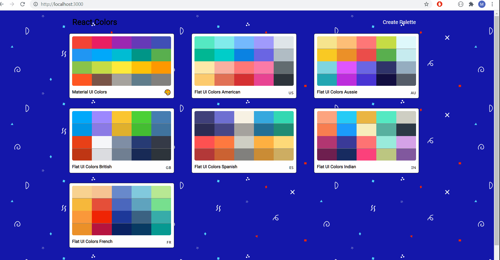
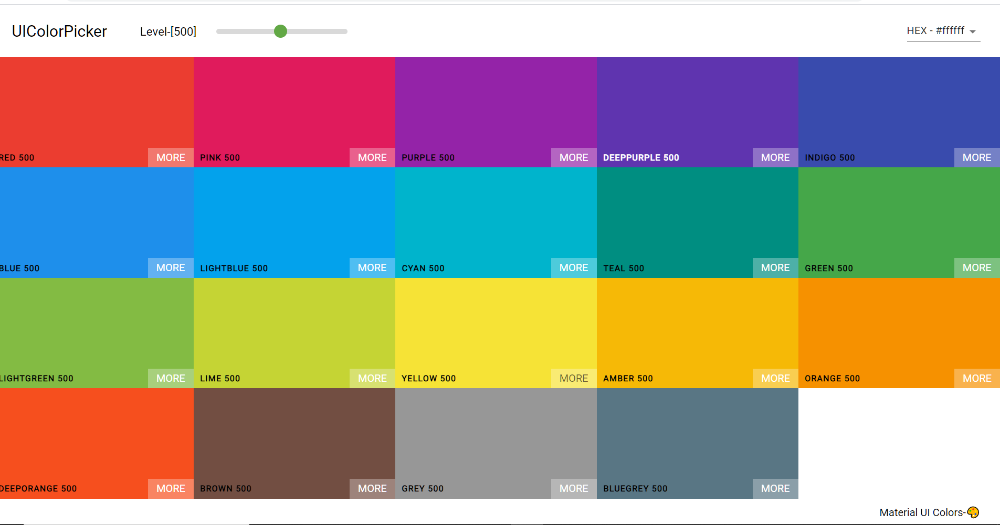
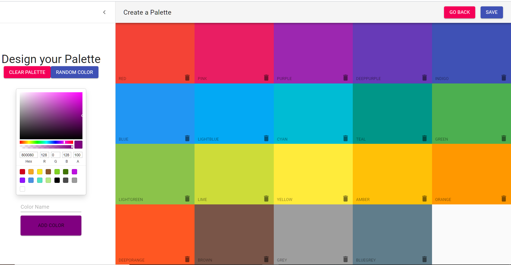

# flatuicolors-clone

  

  This project is a clone of http://materialuicolors.co/?utm_source=launchers and https://flatuicolors.com/

## Features
  <ul>
    <li>
      User can create his own collection of colors and store it in a palette 
    </li>
    <li>
      User can copy the color and use the rgba,rgb or hex code in his project
    </li>
    <li>
      User can choose between 10 different shades of the same color
    </li>
    <li>
      Can organize the colors in the palette in any order
    </li>
    <li>
      Validiation to avoid duplicate colors,color names or palettes
    </li>
  </ul>

## Tech Stack used:

<code></code>
<code></code>
<code></code>
<code></code>
<code></code>
<code></code>

## Demo

## <code>Landing Page</code>

## <code>Create Palette Page</code>

### Installation and Setup Instructions

Clone down this repository. You will need node and npm installed globally on your machine. Installation: npm install To Run Test Suite: npm test To Start Server: npm start To Visit App: localhost:3000/

## Tech Library used:
  <ul>
  <li>React APP</li>
  <li>Axios</li>
  <li>Material UI</li>
  <li>react-router-dom</li>
  <li>uuid</li>
  <li>chroma-js</li>
   <li>classnames</li>
  <li>emoji-mart</li>
  <li>rc-slider</li>
  <li>react-color</li>
  <li>react-copy-to-clipboard</li>
  <li>react-material-ui-form-validator</li>
  </ul>

